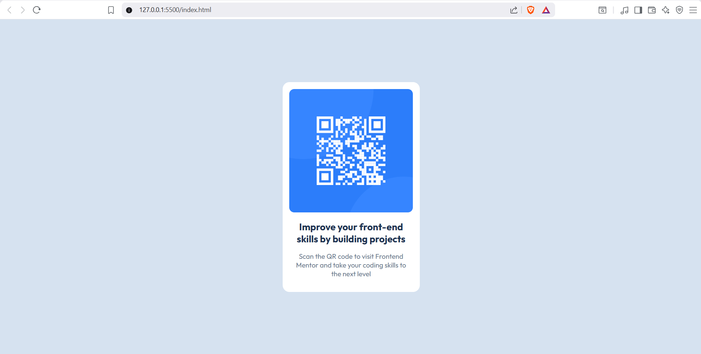
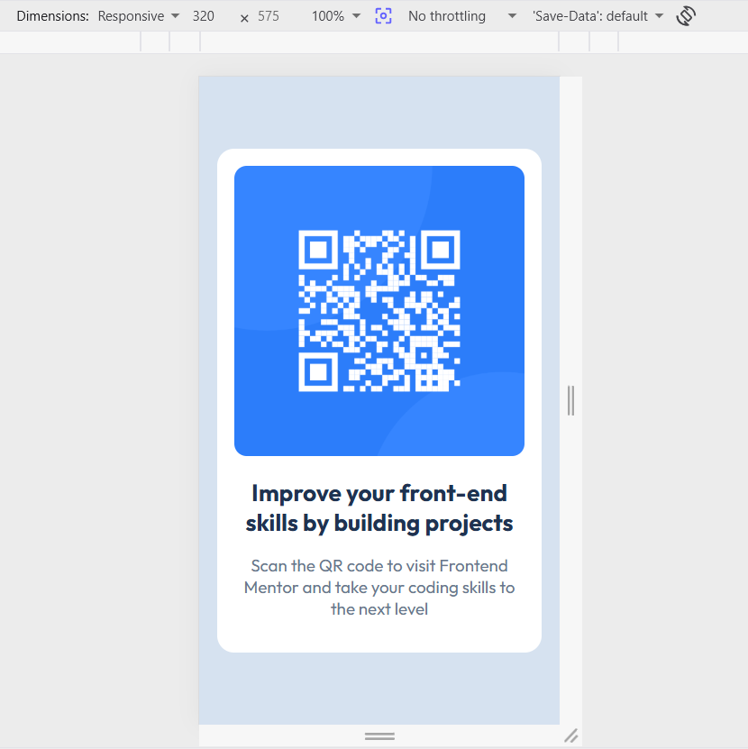

# Frontend Mentor - QR code component solution

This is a solution to the [QR code component challenge on Frontend Mentor](https://www.frontendmentor.io/challenges/qr-code-component-iux_sIO_H). Frontend Mentor challenges help you improve your coding skills by building realistic projects. 

## Table of contents

- [Overview](#overview)
  - [Screenshot](#screenshot)
  - [Links](#links)
- [My process](#my-process)
  - [Built with](#built-with)
  - [What I learned](#what-i-learned)
  - [Continued development](#continued-development)
  - [AI Collaboration](#ai-collaboration)
- [Author](#author)

## Overview

### Screenshot

### Links

- Solution URL: [Add solution URL here](https://your-solution-url.com)
- Live Site URL: [Add live site URL here](https://your-live-site-url.com)

## My process

### Built with

- Non-semantic HTML5 markup
- CSS custom properties
- Flexbox
- Desktop-first workflow 

### What I learned

In this project, I learned the magic of "margin: 0 auto;"
I was thinking of using position relative or absolute at first haha. 

### Continued development

I'm still having a hard time positioning elements. Like, what css properties should each have. Therefore, this is what I'm determined to learn as I complete future challenges or try to create my own design.

### AI Collaboration

I was having a hard time figuring out how to add spacing on the left and right sides of the QR Code container without using media queries, therefore I asked CHATGPT for assistance. It gave me multiple solutions, and the one I tried to use is adding a padding to the body.

## Author

- Frontend Mentor - [@arceoche](https://www.frontendmentor.io/profile/arceoche)
- instagram - [@geminic.a](https://www.instagram.com/geminic.a)
